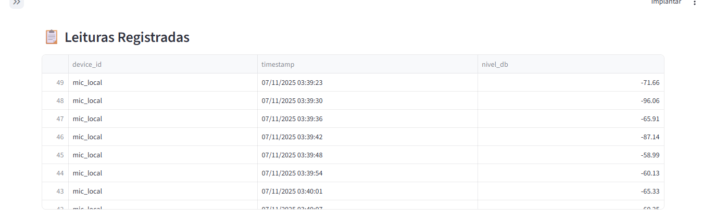
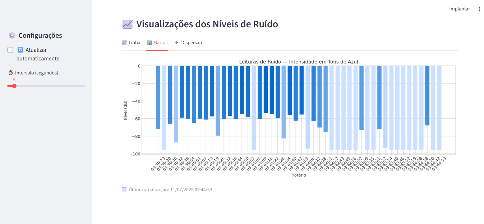
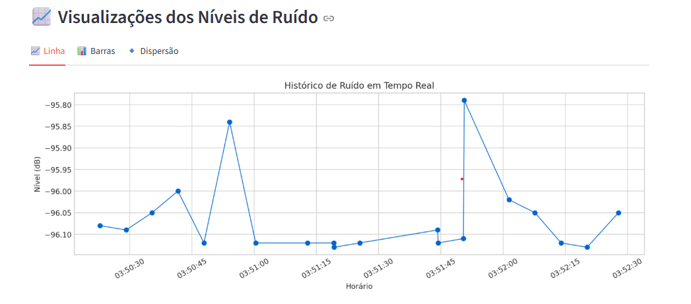
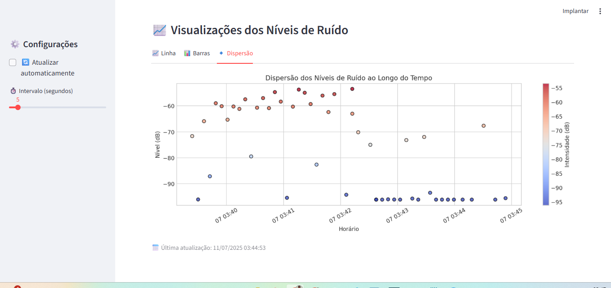
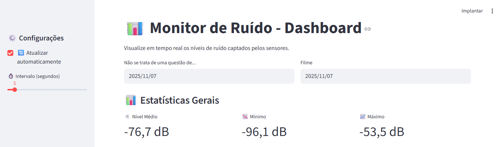
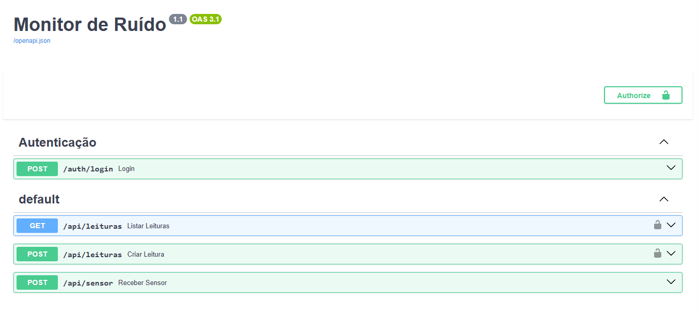

<div align="center">

# 🎧 Monitor de Ruído — Sistema Inteligente de Monitoramento Acústico

<table align="center">
<tr>
<td></td>
<td></td>
</tr>
<tr>
<td></td>
<td></td>
<tr>
<td></td>
<td></td>
</tr>
</tr>
</table>

</div>

---

## 🌍 Propósito Social

O **Monitor de Ruído** é um projeto criado com o propósito de **ajudar a população a monitorar níveis de som abusivos** em ambientes urbanos — como **baladas, bares, fábricas e eventos noturnos** — que frequentemente ultrapassam os limites aceitáveis e prejudicam o **bem-estar, a saúde e o descanso das pessoas**.

Através de sensores conectados e um sistema inteligente de análise, o projeto busca **dar visibilidade a um problema silencioso: a poluição sonora**.

💬 **Missão:**  
Promover ambientes mais saudáveis e respeitosos através da tecnologia,  
unindo **dados, consciência ambiental e cidadania**.

---

## 💡 O que o sistema faz

O **Monitor de Ruído** é uma solução integrada que:

- 🎤 **Captura sons em tempo real** via sensores de microfone;  
- ⚙️ **Envia automaticamente os dados** para uma API de monitoramento;  
- 💾 **Armazena o histórico** de ruídos registrados;  
- 📊 **Exibe gráficos interativos** e estatísticas sobre os níveis de ruído;  
- 🧾 **Gera relatórios** para análise e tomada de decisão.

É ideal para:
- Moradores que sofrem com **som alto durante a madrugada**;  
- Órgãos públicos de fiscalização ambiental;  
- Universidades e escolas técnicas que pesquisam **acústica urbana**;  
- Empresas e fábricas que precisam **controlar ruído industrial**;  
- Projetos de **cidades inteligentes (Smart Cities)**.

---
### OBS. Ainda estou trabalhando nas possíveis melhoria jonto com a AI
--

## 🧠 Estrutura do Projeto

```bash
monitor_ruido/
│
├── backend/           # API FastAPI que recebe e armazena os níveis de ruído
│   ├── main.py
│   ├── auth.py / auth_routes.py
│   ├── data/
│   ├── tests/
│   ├── leituras.db
│   └── Dockerfile
│
├── sensor/            # Módulo que capta ruído pelo microfone e envia para a API
│   ├── sensor_noise.py
│   ├── testar_microfone.py
│   ├── requirements.txt
│   └── Dockerfile
│
├── dashboard/         # Painel interativo (Streamlit)
│   ├── streamlit_app.py
│   ├── requirements.txt
│   └── Dockerfile
│
├── reports/           # Geração de relatórios automáticos e análises
│   └── generate_report.py
│
├── docker-compose.yml # Orquestração dos serviços
├── requirements.txt
├── setup.sh
└── README.md


